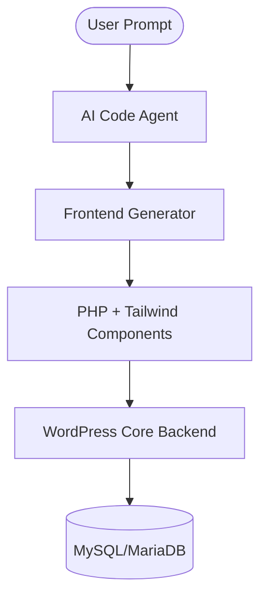

# BARE-WP: AI-Driven Headless WordPress UI Engine

> A high-performance, plugin-free frontend development environment powered by WordPress Core and AI generation.

## 📋 Overview

**BARE-WP** is a development platform that leverages WordPress Core strictly as a headless backend data engine (posts, users, media, authentication) while providing a completely custom, AI-powered frontend development environment built with PHP, HTML, and TailwindCSS.

It eliminates the overhead of WordPress themes, page builders, and excessive plugins, giving developers and AI agents full control over the rendering lifecycle and code structure.

---

## 🚀 Key Features

- **Prompt-to-Page Generation**: Leverage AI to interpret natural language prompts and generate clean, modular PHP + TailwindCSS templates.
- **Headless WordPress Core**: Uses standard WP tables and APIs for reliable data management without the traditional frontend "bloat."
- **Zero-Plugin Philosophy**: All frontend functionality (forms, sliders, galleries) is handled by generated code, not third-party plugins.
- **Live Code Sandbox**: Integrated preview and execution environment for testing generated code in real-time.
- **TailwindCSS Native**: Utility-first styling for maximum performance and design flexibility.

---

## 🏗️ Architecture Blueprint



- **Backend Logic**: WordPress handles content management, taxonomy, media, and user auth.
- **Frontend Layer**: A custom PHP UI engine (`/src`) communicates with the core headlessly.
- **Data Access**: Direct PHP bootstrapping for ultra-low latency or REST API for decoupled services.

---

## 🛠️ Technical Stack

| Layer | Technology |
| :--- | :--- |
| **Backend CMS** | WordPress Core (PHP 8.2+) |
| **Database** | MariaDB 10.11 |
| **Styling** | TailwindCSS |
| **Frontend Logic** | Custom PHP MVC Controller/Router |
| **Containerization** | Docker + Docker Compose |
| **Assistant Skills** | Specialized Agentic Workflows |

---

## 📂 Project Structure

```text
.
├── .agent/              # Assistant skills and specialized workflows
├── public/              # Web document root
│   ├── index.php        # Custom frontend entry point (bypasses WP themes)
│   └── wp-core/         # Unmodified WordPress Core files (backend engine)
├── src/                 # Custom PHP UI Development Engine
│   ├── Controllers/     # Request handlers
│   ├── Models/          # Data wrappers interacting with WP Core
│   └── Agents/          # AI Code Agent logic
├── storage/             # Caching, logs, and temporary preview files
├── Dockerfile           # Hardened, non-root Apache/PHP environment
└── docker-compose.yaml  # Multi-container orchestration
```

---

## 🏁 Getting Started

### 1. Prerequisites
- Docker and Docker Compose installed.
- Git.

### 2. Installation
Clone the repository and spin up the environment:
```bash
git clone https://github.com/Temples-Dev/bare-wp.git
cd bare-wp
docker-compose up -d --build
```
The application will be available at `http://localhost:8080`.

### 3. Using the Sandbox
Navigate to `/preview` to access the Live Preview Sandbox, where you can prompt the AI agent or manually edit PHP/Tailwind templates with instant hot-reloading.

---

## 🔒 Security
- **Non-Root Execution**: Container runs as a dedicated `www-data` user.
- **Isolated Core**: WordPress core files are isolated in `public/wp-core`.
- **Sandbox Hardening**: Rendering engine prevents PHP execution in user-submitted preview HTML.

---

## 📜 License
This project is licensed under the MIT License.